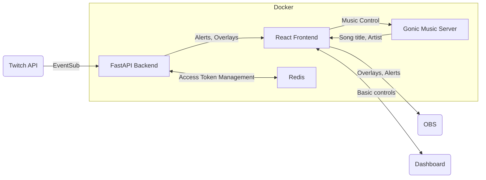

# OverlayForge

## Purpose

OverlayForge is a Streaming tool that provides Overlays, Alerts, a Chat window and a simple music player for local files.

## Architecture

```mermaid
flowchart LR

c1("OBS")
c2("Dashboard")
n1["React Frontend"]
n2["FastAPI Backend"]
n3["Redis"]
n4["Gonic Music Server"]
e1("Twitch API")

e1 -->|EventSub| n2

subgraph Docker
n2 -->|Alerts, Overlays| n1
n3
n4 -->|Song title, Artist| n1
n2 <-->|Access Token Management| n3
n1 -->|Music Control| n4
end

n1 -->|Overlays, Alerts| c1
n1 <-->|Basic controls| c2
```